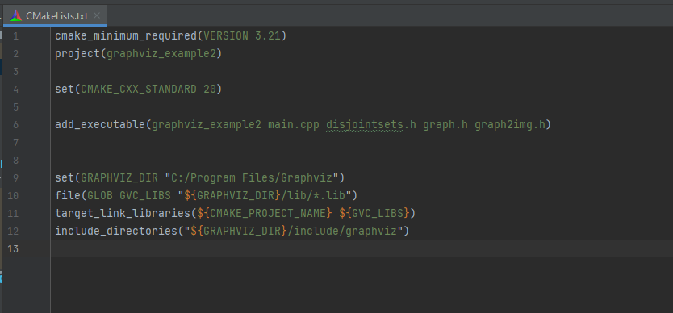

# How to use Graphviz with C++ on Windows/Mac os
### Configuration
 1. Install Graphviz for [Windows](https://graphviz.org/download/#windows)/[Mac OS](https://graphviz.org/download/#mac) and remember the installation path. In my case it is "C:\\Program Files\\Graphviz".
 2. Next we need to add the libraries (files from "Graphviz\\lib") and its includes ("Graphviz\\include\\graphviz") to a project.
 3. Open CMakeLists.txt and define the location of our library using "set" command. Replace "C:/Program Files/Graphviz" with your path.
 ```cmake 
set(GRAPHVIZ_DIR "C:/Program Files/Graphviz") 
```
4. Add the libraries and includes
 ```cmake
file(GLOB GVC_LIBS "${GRAPHVIZ_DIR}/lib/*.lib")
target_link_libraries(${CMAKE_PROJECT_NAME} ${GVC_LIBS})
include_directories("${GRAPHVIZ_DIR}/include/graphviz")
```

You will end up with a CMake like this


### Application
0. To save graphs w/o specifying an absolute path add a working directory. In CLion: Run -> Edit Configuration -> Working directory.
1. Create a graph object (You can check an example in the project folder)
2. Add a modified ```graph2img``` header file to your project
2. Use the ```printImage()``` method and path a filename, extension, and the graph:
```C++
    MyGraph graph;
    buildGraph(graph);
    MyGraph mst = kruskal(graph);

    printImage("output", "png", graph);
```
4. Run the code


---
**Note** <br/>
To get a dot file use the "gv" extension
---
